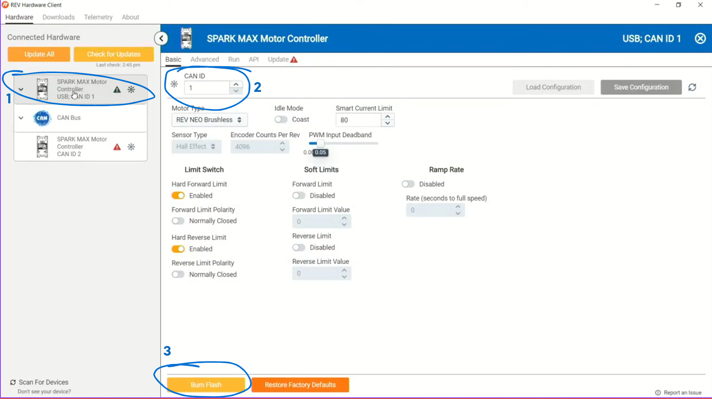

# 0.1 Configuring Rev Motors
In this activity, students learn about can IDs and motors by using Rev Hardware Client to configure motors. 
## Setup
This activity is designed for a testbed with 3 motors: two flywheel / shooter motors and one arm motor. The shooter motors are both set to 100% duty cycle while the `A` button on an xbox controller is held. The arm motor is controlled with the left stick, with a maximum duty cycle of 25. 

Because of the risk of incorrect assignment causing the arm to move at high speed, the code contains a safeguard which will through an exception and console warning if it is detected that the arm motor is set to the CAN ID of a shooter motor. To make this work, **the P value of the arm motor must be to 1**. Without this, the safeguard will not work.

## Instructions
1. Read and interpret the following snippet 
```java
public static final ShooterConstants {
    public static final int LEFT_MOTOR_ID = 1;
    public static final int LEFT_MOTOR_ID = 2;
}
public static final ArmConstants {
    public static final int ARM_MOTOR_ID = 3;
}
```
2. Plug a USB-C cable into each Spark Max
3. Refer to the following image to set the CAN ID of the appropriate value  
> 
> 1. Select the top spark max on the left. This is the spark max directly connected to the laptop
> 2. Enter the correct CAN ID according to the snippet above
> 3. Click burn flash and confirm if prompted
4. After all motors have been configured, turn on the robot, connect driverstation, and run the motors according to your instructor's instructions

